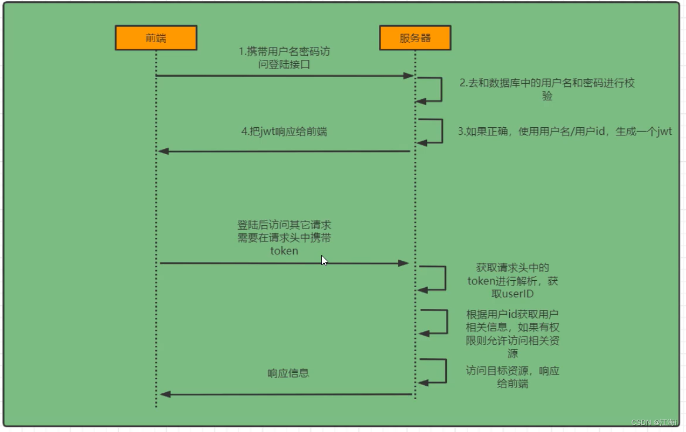

# springsecurity-jwt

SpringSecurity+jwt前后端分离登录认证

> 参考: [https://blog.csdn.net/weixin_44289860/article/details/125132025](https://blog.csdn.net/weixin_44289860/article/details/125132025)
> 
> 注意: 在[springsecurity-quickstart](https://github.com/yangjianzhi22/springsecurity-quickstart)的基础上实现jwt验证

## spring security

Spring Security 是一个功能强大且高度可定制的身份验证和访问控制框架

## jwt 

JSON Web Token（JWT）是一个开放的行业标准（RFC 7519），它定义了一种简介的、自包含的协议格式，用于在通信双方传递json对象，传递的信息经过数字签名可以被验证和信任。

## 认证逻辑

#### 1. 登录流程



#### 2. 核心

- 过滤器

**UsernamePasswordAuthenticationFilter**：处理登录页中的登录请求

**ExceptionTranslationFilter**：处理过滤器链中的异常

**FilterSecurityInterceptor**：权限校验过滤器

- 实现类

**Authentication**：实现类，表示当前访问系统的用户，封装了相关用户信息

**AuthenticationManager**：定义认证Authentication方法

**UserDetailsService**：加载用户特定数据的核心接口；包含一个根据用户名查询用户信息的方法

**UserDetails**：提供核心用户信息，通过UserDetailsService根据用户名获取处理的用户信息封装成UserDetailsService对象返回，然后将信息封装到Authentication对象中

## 实现

#### 登录认证逻辑(认证通过生成JWT；将用户信息存入redis)

```
@Service
public class UserServiceImpl implements UserService {

    @Autowired
    private UserMapper userMapper;

    @Autowired
    private AuthenticationManager authenticationManager;
    @Autowired
    private RedisUtil redisUtil;

    @Override
    public jwt login(String username, String password) {
        UsernamePasswordAuthenticationToken authenticationToken = new UsernamePasswordAuthenticationToken(username, password);

        try{
            // 认证
            Authentication authentication = authenticationManager.authenticate(authenticationToken);

            // 认证失败
            if (Objects.isNull(authentication)) {
                throw new RuntimeException("用户名或密码错误");
            }

            // 认证成功
            LoginUser loginUser = (LoginUser) authentication.getPrincipal();
            String userid = String.valueOf(loginUser.getUser().getId());

            // 根据用户id生成jwt, 将用户信息存入redis
            redisUtil.set("login:" + userid, loginUser);

            return JwtUtil.createJWT(userid);
        }catch (Exception e) {
            e.printStackTrace();
            return null;
        }
    }
}
```

#### jwt过滤器 (获取token，解析token，获取userid，去redis中获取用户信息；将用户信息存入SecurityContextHolder)

- 过滤器

```
@Component
public class JwtAuthenticationTokenFilter extends OncePerRequestFilter {

    @Autowired
    private RedisUtil redisUtil;

    @Override
    protected void doFilterInternal(HttpServletRequest request, HttpServletResponse response, FilterChain filterChain) throws ServletException, IOException {
        // 获取token
        String token = request.getHeader("token");
        if (!StringUtils.hasText(token)) {
            //直接放行 让后面原生的 security 去拦截
            filterChain.doFilter(request, response);
            return;
        }

        // 解析token
        String userid;
        try {
            Claims claims = JwtUtil.parseJWT(token);
            userid = claims.getSubject();
        } catch (Exception e) {
            e.printStackTrace();
            throw new RuntimeException(e);
        }

        // 从redis获取用户信息
        Object obj = redisUtil.get("login:" + userid);
        if (Objects.isNull(obj)) {
            filterChain.doFilter(request, response);
            return;
        }
        LoginUserDetails loginUser = JSON.parseObject(JSON.toJSON(obj).toString(), LoginUserDetails.class);

        // 将用户信息存入SecurityContextHolder
        UsernamePasswordAuthenticationToken authenticationToken = new UsernamePasswordAuthenticationToken(loginUser, null, null);
        SecurityContextHolder.getContext().setAuthentication(authenticationToken);

        // 放行
        filterChain.doFilter(request, response);
    }
}
```

- 配置jwt过滤器

```
@EnableWebSecurity
public class WebSecurityConfig extends WebSecurityConfigurerAdapter {

    @Autowired
    private JwtAuthenticationTokenFilter jwtAuthenticationTokenFilter;

    ...

    @Override
    protected void configure(HttpSecurity http) throws Exception {
        ...
        
        http.addFilterBefore(jwtAuthenticationTokenFilter, UsernamePasswordAuthenticationFilter.class);
    }
}
```

#### 退出登录

```
@PostMapping("/logout2")
public Object logout() {
    try {
        // 获取SecurityContextHolder中用户id
        UsernamePasswordAuthenticationToken authentication = (UsernamePasswordAuthenticationToken) SecurityContextHolder.getContext().getAuthentication();
        LoginUserDetails loginUser = (LoginUserDetails) authentication.getPrincipal();
        // 删除redis中值
        redisUtil.del("login:"+loginUser.getSysUser().getId());
        return loginUser;
    }catch (Exception e) {
        return "未登录!";
    }
}
```